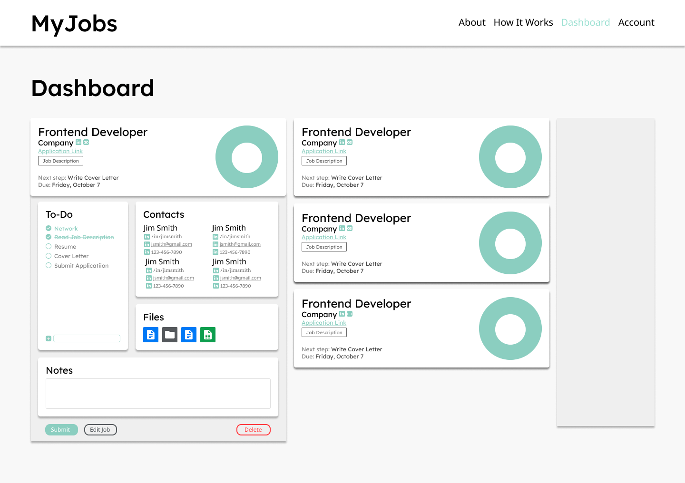

# [Job Notebook](https://jobnotebook.vercel.app)

[Job Notebook](https://jobnotebook.vercel.app) is a tool for job seekers to keep track of their current applications. In today's job market, there are many steps for potential candidates. The one's that are taking their time can struggle to keep each one straight. Unlike other job trackers, [Job Notebook](https://jobnotebook.vercel.app) focuses on what the user needs to do BEFORE submitting their application.

## Project Journal

### October 6, 2023

  Today I built the modal component that will wrap various nested children on the site (individual applications, add application form, login/signup forms). When that was built, I added the elements that need to render dynamically on the dashboard aside.

### October 5, 2023

  I decided to use [Clerk](https://clerk.com) for my authentication/user needs. I will store user models in Clerk and use Clerk's user data to call information from MongoDB. It was a long day of studying, researching, and tutorials, but I am proud of where the page is at today!

### October 4, 2023

  The base functionality of the `Dashboard` page is done. User applications are fetched from `MongoDB` and rendered as cards. The user can click on the job dropdown to view detailed information. The next steps are setting up authentication to fetch applications that belong to the logged in user and adding features to allow the user to create applications.

## Tech Stack
- React.js (Next.js)
- Tailwind CSS
- CSS/OOCSS
- JavaScript
- MongoDB/Mongoose
- Clerk
- React-Icons
- Vercel

## Initial Figma Mockup

## Resources

<a target="_blank" href="https://icons8.com/icon/95088/spiral-bound-booklet">Notebook</a> icon by <a target="_blank" href="https://icons8.com">Icons8</a>