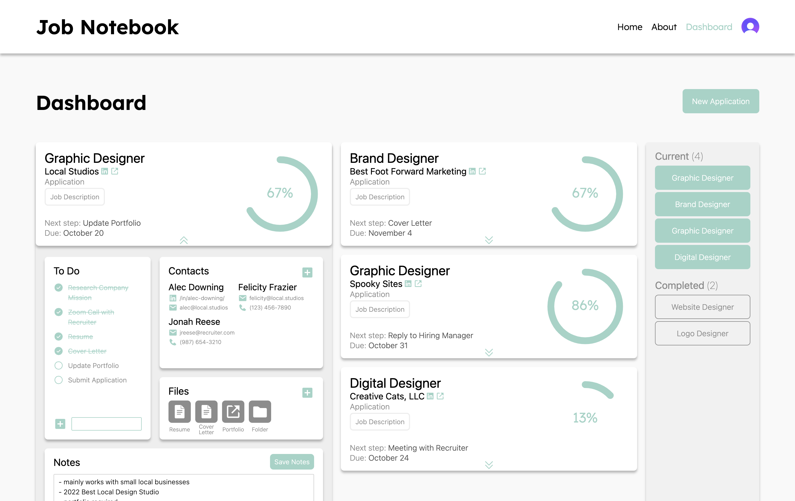

# [Job Notebook](https://jobnotebook.vercel.app)

[Job Notebook](https://jobnotebook.vercel.app) is a tool for job seekers to keep track of their current applications. In today's job market, there are many steps for potential candidates. Applications that take their time can struggle to keep each one straight. Unlike other job trackers, [Job Notebook](https://jobnotebook.vercel.app) focuses on what the user needs to do BEFORE submitting their application.

## Why I Created [Job Notebook](https://jobnotebook.vercel.app)

I created [Job Notebook](https://jobnotebook.vercel.app) in the first month after I graduated from my Full Stack Bootcamp. I was searching lots of job boards and trying to track it all in a spreadsheet. This spreadsheet got pretty long, pretty quick. I found that on top of a running to do list, I was consistently tracking:

  ### Job Details
  - Job Title and Description
  - Company Details
  - Application Link

  ### Contacts
  - Networking Contacts
  - Hiring Managers
  - Various Contact Methods

  ### Files
  - Resume and Cover Letter for Each Job
  - File for Each Job
  - Answers to Prompts on the Application

  ### Notes
  - Notable details I found while researching companies

I needed a better place to track applications, and I could turn that need into a tool for job seekers!

## Usage
  1. Use either `Start your notebook` buttons, the `Dashboard` link, or the `Sign In` link to create an account.
  2. Create an account with Google, LinkedIn, GitHub, or an email and password.
  3. Confirm your email.
  4. On the `Dashboard` page, use `New Application`/`New` to open the New Applicaiton Form.
  5. Fill out the fields you wish and submit the form.
  6. You will now see your application under `Current` on the sidebar.
  7. Use the double caret to show more details about your application.
  8. You can add details to your application with the `Edit Application` button (part of dropdown)
  9. Use the `plus icons` to add tasks, contacts, files, and notes
  10. As you check off tasks, the percentage bar will update and the next task will appear after `Next step:`
  11. When you finish an application, use the `Mark Complete` button (you can always change it back if needed)
  12. If needed, use the `Delete` button. After confirming, this is permanant.

## Tech Stack

### React.js (Next.js) (JavaScript)
  - interactive site that needs to update individual components with updated information
  - Next.js provided the architecture for Mongoose routes

### Tailwind CSS/CSS/OOCSS

### Radix UI
  - modals and forms

### Clerk 
  - authentication service that stores users and allows third-party signup

### MongoDB/Mongoose

### Sonner Toast

### React-Icons

### Vercel

## Visuals

### Homepage

### Dashboard

## Initial Figma Mockup

The Dashboard is the focal point of the site. I went through the design process from wireframes to mockups to code. Below is the initial mockup of the Dashboard page.

## Contact

For issues, please create an issue on the [project repo](https://github.com/a-down/job-notebook-application-tracker/issues).

For questions or conversations, reach out [LinkedIn](https://linkedin.com/in/alec-downing/)

## Resources

[Phosphor Icons](https://phosphoricons.com/)

[Icons8](https://https://icons8.com/)

[Box Icons](https://boxicons.com/)

[Simple Icons](https://simpleicons.org/)